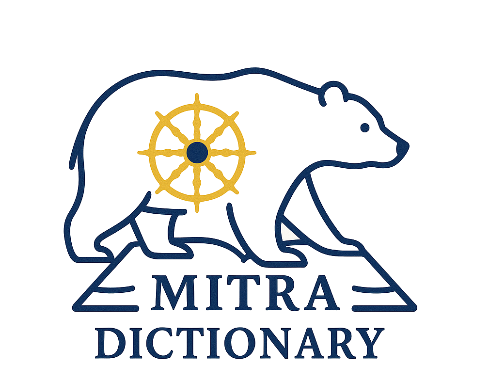

  

# Dharmamitra StarDict Dictionaries

Automatically generated bilingual dictionaries based on parallel sentence data, provided by Dharmamitra. 

## Overview

These StarDict format dictionaries are created from parallel sentence alignments to assist in research for Sanskrit<>Tibetan. They can be used with GoldenDict and other compatible viewers. A Mac version is under preperation. 

## Dictionaries Available

The Sanskrit-Tibetan dictionary is here: [MITRA sa-bo](https://dharmamitra.org/pub/dictionaries/mitra-dictionary-skt-tib.zip)  
The Tibetan-Sanskrit dictionary is here: [MITRA bo-sa](https://dharmamitra.org/pub/dictionaries/mitra-dictionary-tib-skt.zip) 
Warning: Each dictionary will require more than 10GB of disk space after unzipping! These contain over 4m headword entries based on 600,000 parallel Sanskrit-Tibetan sentence pairs.
## Features

  

- Bilingual translations of terms and phrases automatically extracted from large sets of parallel sentence pairs  
- StarDict format compatible with many dictionary applications  

## Limitations
- The phrase entries of the dictionaries are automatically generated, they are not manually checked and we don't claim that these are exhaustive resources. The boundary detection is not always reliable. These are not manually curated dictionaries, so use with caution!
- The size is large with millions of entries based on more than 1.7m sentence pairs combined. The rendering can therefore be a bit slow depending on the entry size. 

## Usage

1. Download the desired dictionary files from the link above and unzip them to your favorite folder
2. Install a StarDict-compatible dictionary viewer (like GoldenDict, StarDict, or SDCV)
3. Add your favorite folder with the dictionary files to your viewer
4. Start looking up terms!

## Compatible Software

These dictionaries work with:
- GoldenDict
- StarDict
- SDCV (StarDict Console Version)
- And other StarDict-compatible dictionary programs

## License

These dictionaries are released under the [Creative Commons Attribution-ShareAlike 4.0 International License (CC BY-SA 4.0)](https://creativecommons.org/licenses/by-sa/4.0/).
## Acknowledgments

These dictionaries are created by Sebastian Nehrdich and Kurt Keutzer in context of the [Dharmamitra.org](https://dharmamitra.org) project with generous support by the Tsadra Foundation.
We are dedicated to making work on Sanskrit, Tibetan, and Buddhist Chinese easier. 

## Citation

Coming soon!

---

A project of <a href="https://dharmamitra.org">Dharmamitra.org</a>

