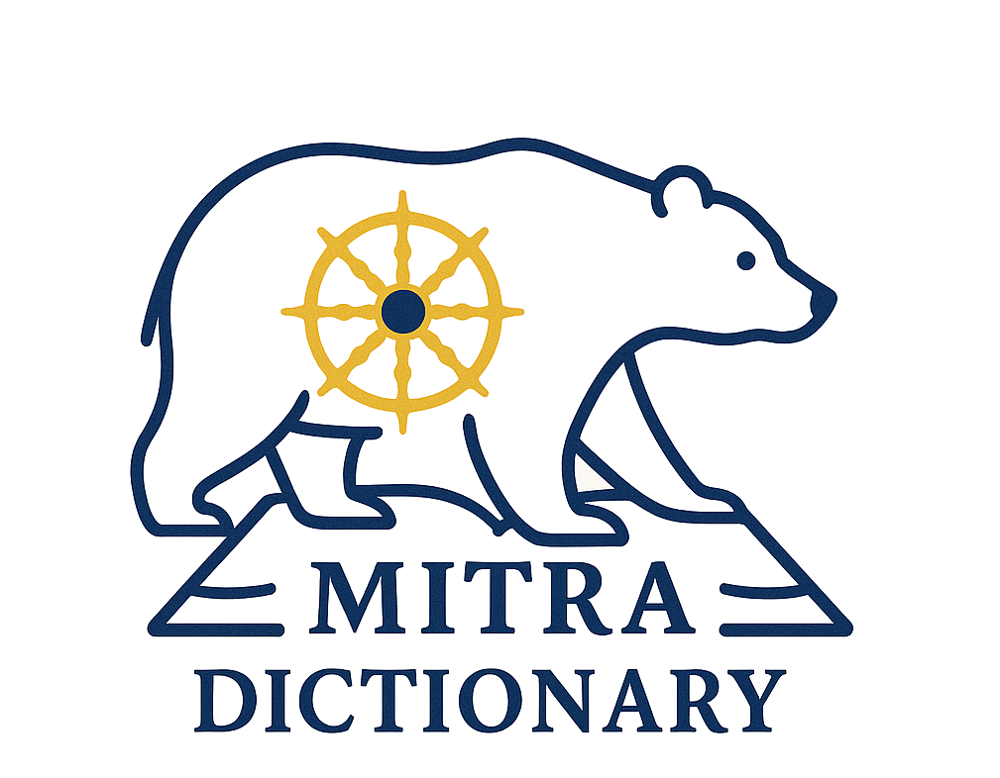
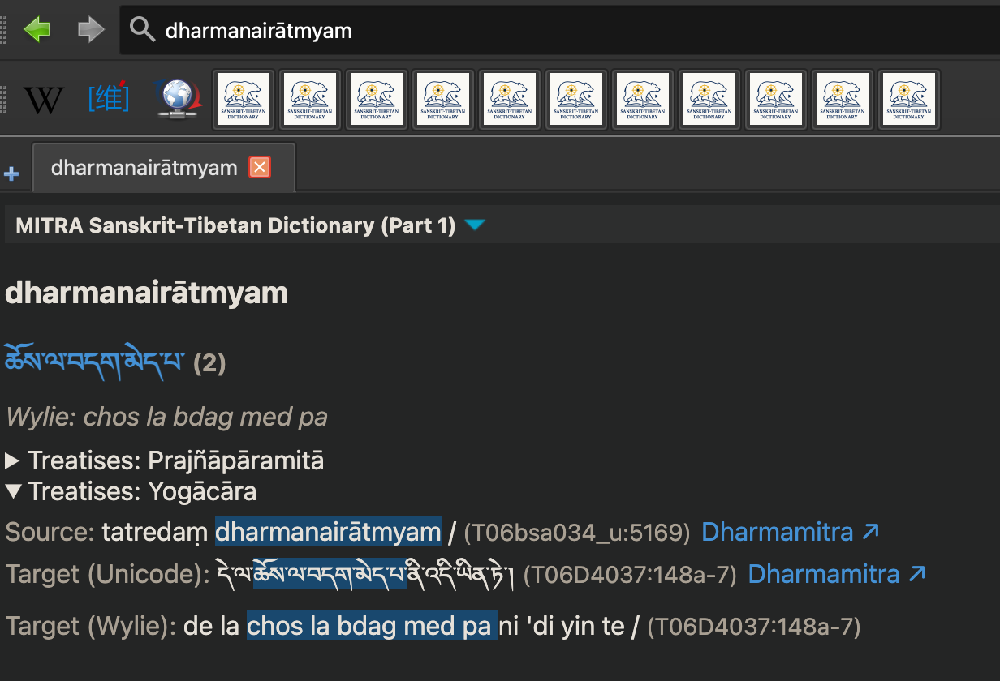

<p align="center">
  
</p>

# Dharmamitra StarDict Dictionaries

Bilingual and multilingual dictionaries for Sanskrit, Tibetan and Buddhist Chinese, generated automatically from parallel texts by [Dharmamitra](https://dharmamitra.org). They are available for GoldenDict and other StarDict viewers, and as native macOS dictionaries for Dictionary.app.

## MITRA Lexica (September 2026)

The **MITRA Tibetan Lexicon** and the **MITRA Sanskrit Lexicon** are the current release. Each entry lists how a word is rendered in the other languages of the corpus, how often each rendering is attested, grammatical information, and cited example passages with the word highlighted in both languages and linked to the source text on dharmamitra.org.

### Downloads

| Dictionary | GoldenDict / StarDict | macOS Dictionary.app |
|---|---|---|
| MITRA Tibetan Lexicon (2026.09.26) | [mitra-stardict-tib-lexicon-2026.zip](https://dharmamitra.org/pub/dictionaries/mitra-stardict-tib-lexicon-2026.zip) (198 MB) | [mitra-appledict-tib-lexicon-2026.zip](https://dharmamitra.org/pub/dictionaries/mitra-appledict-tib-lexicon-2026.zip) (382 MB) |
| MITRA Sanskrit Lexicon (2026.09.24) | [mitra-stardict-skt-lexicon-2026.zip](https://dharmamitra.org/pub/dictionaries/mitra-stardict-skt-lexicon-2026.zip) (271 MB) | [mitra-appledict-skt-lexicon-2026.zip](https://dharmamitra.org/pub/dictionaries/mitra-appledict-skt-lexicon-2026.zip) (512 MB) |

SHA-256 checksums: [SHA256SUMS-lexicon-2026.txt](https://dharmamitra.org/pub/dictionaries/SHA256SUMS-lexicon-2026.txt)

The StarDict files are compressed with `dictzip` (`.dict.dz`), so they stay compressed on disk and GoldenDict reads them directly: about 220 MB (Tibetan) and 284 MB (Sanskrit) after unzipping. Installed, the macOS bundles take 441 MB and 595 MB.

### Statistics

| | MITRA Tibetan Lexicon | MITRA Sanskrit Lexicon |
|---|---:|---:|
| Headwords | 223,486 | 332,328 |
| Additional lookup keys (synonyms) | 459,173 | 648,144 |
| Numbered senses | 251,937 | 276,692 |
| Cited example passages | 618,208 | 982,523 |
| Entries with English renderings | 123,256 | 234,751 |
| Entries with Sanskrit renderings | 123,826 | — |
| Entries with Tibetan renderings | — | 148,543 |
| Entries with Chinese renderings | 44,110 | 51,346 |
| Linked source texts on dharmamitra.org | 8,403 | 4,113 |
| Minimum attestations | 3 per entry | 2 per rendering |

**Tibetan Lexicon.** Headwords are Tibetan stems in Wylie. Tibetan script, with and without the final tsheg, and inflected forms such as the agentive *bla mas* or terminative *bla mar* are lookup keys that lead to the same entry. Entries include part-of-speech profiles from a Classical Tibetan tagger, verb paradigms, and cross-references to derived forms, variants, and synonyms recorded in the Hopkins, 84000 and Rangjung Yeshe glossaries. 203,429 entries have one sense and 20,057 have two or more.

**Sanskrit Lexicon.** Headwords are Sanskrit lemmas in IAST, following the Digital Corpus of Sanskrit. 258,497 lemma entries carry senses, grammatical profiles and references to Böhtlingk & Roth (PWG). A further 73,831 entries are attested inflected forms (e.g. *atītam*, *gatvā*), each pointing to its root. Diacritic-free and hyphen-free spellings (`prajna`, `sarvadharma`) are lookup keys, so IAST input is optional. The 1,273 spellings that belong to two headwords (e.g. *āha* as a noun and as the perfect of *ah*) are merged into one entry with both articles.

The entries were drafted by Gemma 4 31B from span alignments of the Dharmamitra parallel corpora (qwen-v2), and every entry or rendering meets the attestation minimum shown above.

### Installation

**GoldenDict / GoldenDict-ng (Windows, Linux, macOS)**
1. Unzip the StarDict zip into a folder of your choice.
2. In GoldenDict, go to *Edit → Dictionaries → Sources → Files*, add that folder and click *Rescan*.

**macOS Dictionary.app**
1. Unzip the Apple zip. You get `mitra-tib-llm-2026.dictionary` or `mitra-skt-llm-2026.dictionary`.
2. Move it to `~/Library/Dictionaries/` (in Finder: *Go → Go to Folder…* and paste the path).
3. Open Dictionary.app, go to *Settings*, and tick **MITRA Tibetan Lexicon** / **MITRA Sanskrit Lexicon**. Drag them up the list to change their order.

The words are then also available through *Look Up* (three-finger tap or Ctrl-Cmd-D) in any macOS app. To update, replace the old `.dictionary` folder and restart Dictionary.app.

### Building

`build/build.sh` rebuilds both release zips from a StarDict folder: `dictzip`, then pyglossary and Apple's Dictionary Development Kit. `build/appledict/` holds the plist and CSS that set the display names and hide the duplicate headword. See the comment at the top of the script for requirements.

## Earlier sentence-pair dictionaries (June 2026)

The first MITRA dictionaries, extracted from about 1.7 million parallel sentence pairs, are still available. They have more than 4 million phrase entries per language pair, but they are not curated, phrase boundaries are not always reliable, and they are large: 1–3.3 GB per pair after unzipping.

| Pair | StarDict | macOS (DDK source) |
|---|---|---|
| Sanskrit → Tibetan | [mitra-stardict-skt-tib.zip](https://dharmamitra.org/pub/dictionaries/mitra-stardict-skt-tib.zip) | [mitra-appledict-skt-tib.zip](https://dharmamitra.org/pub/dictionaries/mitra-appledict-skt-tib.zip) |
| Tibetan → Sanskrit | [mitra-stardict-tib-skt.zip](https://dharmamitra.org/pub/dictionaries/mitra-stardict-tib-skt.zip) | [mitra-appledict-tib-skt.zip](https://dharmamitra.org/pub/dictionaries/mitra-appledict-tib-skt.zip) |
| Sanskrit → Chinese | [mitra-stardict-skt-chn.zip](https://dharmamitra.org/pub/dictionaries/mitra-stardict-skt-chn.zip) | [mitra-appledict-skt-chn.zip](https://dharmamitra.org/pub/dictionaries/mitra-appledict-skt-chn.zip) |
| Chinese → Sanskrit | [mitra-stardict-chn-skt.zip](https://dharmamitra.org/pub/dictionaries/mitra-stardict-chn-skt.zip) | [mitra-appledict-chn-skt.zip](https://dharmamitra.org/pub/dictionaries/mitra-appledict-chn-skt.zip) |
| Tibetan → Chinese | [mitra-stardict-tib-chn.zip](https://dharmamitra.org/pub/dictionaries/mitra-stardict-tib-chn.zip) | [mitra-appledict-tib-chn.zip](https://dharmamitra.org/pub/dictionaries/mitra-appledict-tib-chn.zip) |
| Chinese → Tibetan | [mitra-stardict-chn-tib.zip](https://dharmamitra.org/pub/dictionaries/mitra-stardict-chn-tib.zip) | [mitra-appledict-chn-tib.zip](https://dharmamitra.org/pub/dictionaries/mitra-appledict-chn-tib.zip) |

The macOS zips of this set contain Dictionary Development Kit sources, which you have to build yourself with `make && make install`.

<p align="center">
  
</p>

## Limitations

- All entries are generated automatically and have not been checked by hand. Renderings, sense divisions and grammatical labels can be wrong, and rare words are under-represented. Treat them as pointers into the texts, not as authoritative definitions, and check the cited passages.
- About 0.5% of source citations in the Tibetan Lexicon show a raw Markdown link where the source text title contains a line break.

## License

These dictionaries are released under the [Creative Commons Attribution-ShareAlike 4.0 International License (CC BY-SA 4.0)](https://creativecommons.org/licenses/by-sa/4.0/).

## Acknowledgments

These dictionaries are created by Sebastian Nehrdich and Kurt Keutzer in the context of the [Dharmamitra.org](https://dharmamitra.org) project, with generous support from the Tsadra Foundation.
We are dedicated to making work on Sanskrit, Tibetan, and Buddhist Chinese easier.

## Citation

```bibtex
@inproceedings{nehrdich-2022-sanstib,
    title = "{S}ans{T}ib, a {S}anskrit - {T}ibetan Parallel Corpus and Bilingual Sentence Embedding Model",
    author = "Nehrdich, Sebastian",
    booktitle = "Proceedings of the Thirteenth Language Resources and Evaluation Conference",
    month = jun,
    year = "2022",
    address = "Marseille, France",
    publisher = "European Language Resources Association",
    url = "https://aclanthology.org/2022.lrec-1.724",
    pages = "6728--6734"
}
```

---

<p align="center">
A project of <a href="https://dharmamitra.org">Dharmamitra.org</a>
</p>
